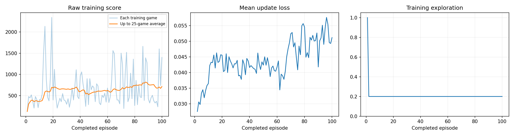
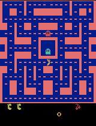
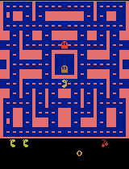

# Ms. Pac-Man DQN Hyperparameter Experiment

## Overview

This project trains the supplied Deep Q-Network (DQN) to play Ms. Pac-Man. I tested exploration rate, episode budget, and learning rate while keeping the notebook's evaluation settings unchanged. My selected run improved the five-game evaluation mean from **492** before training to **746** after training.

The baseline is an **untrained neural network**, not a random-action agent.

## Final configuration

| Hyperparameter | Value | Reason |
|---|---:|---|
| Exploration | 0.20 | This permits random actions often enough to discover alternatives while using the learned policy for most decisions after warm-up. |
| Episodes | 100 | This provides a meaningful training budget while remaining practical in a Colab GPU session. |
| Learning rate | 0.00001 | A small update size was chosen to reduce unstable changes to the network. It produced the strongest and most consistent evaluation among my trials. |

## Expectations before training

I expected the notebook's reference settings—0.20 exploration, 100 episodes, and a 0.0001 learning rate—to improve the agent over the untrained baseline. I also expected that increasing the episode budget, reducing exploration rate, or reducing the learning rate might improve performance further by providing more experience or producing more gradual updates.

## Reproducing the experiment

1. Open [`pacman_dqn.ipynb`](pacman_dqn.ipynb) in Google Colab or a local Jupyter environment using Python 3.11–3.13.
2. If Colab offers a GPU, select it under **Runtime → Change runtime type**.
3. In Section 1, set exploration to `0.20`, episodes to `100`, and learning rate to `0.00001`.
4. Leave the evaluation seeds, 5% evaluation exploration, and evaluation time limit unchanged.
5. Select **Runtime → Run all** and allow setup, baseline evaluation, training, and final evaluation to finish.
6. Download the generated results ZIP before ending the Colab session.

The submitted notebook is the executed final-run version and contains all cell outputs.

## Recorded training run

| Item | Recorded value |
|---|---:|
| Status | Completed |
| Requested/completed episodes | 100 / 100 |
| Total decisions | 57,545 |
| Learning updates | 14,137 |
| Elapsed time, including periodic demos | 235.26 seconds |
| Hardware | CUDA GPU |
| Environment | ALE/MsPacman-v5 |
| Training seed | 42 |
| Evaluation exploration | 0.05 |
| Evaluation seeds | 101, 202, 303, 404, 505 |
| Evaluation time-limited games | 0 before / 0 after |

Evidence: [`config.json`](results/config.json), [`training.csv`](results/training.csv), and [`training_summary.json`](results/training_summary.json).

## Before-and-after evaluation

Both agents were evaluated with the same five seeds, 5% exploration, and fixed time limit.

| Game | Seed | Untrained score | Trained score | Change |
|---:|---:|---:|---:|---:|
| 1 | 101 | 350 | 610 | +260 |
| 2 | 202 | 500 | 630 | +130 |
| 3 | 303 | 320 | 580 | +260 |
| 4 | 404 | 800 | 920 | +120 |
| 5 | 505 | 490 | 990 | +500 |
| **Mean** | — | **492** | **746** | **+254** |

The complete evaluation record is available in [`comparison.json`](results/comparison.json). The trained network improved on the corresponding untrained score in all five games.

## Training dashboard

The dashboard shows the recorded training score, loss, and exploration curves. Loss is useful for monitoring optimization, but a lower loss alone does not guarantee better gameplay.

## Gameplay evidence

### Before training

### Intermediate checkpoints

| Episode 25 | Episode 50 |
|---|---|
|  |  |

| Episode 75 | Episode 100 |
|---|---|
|  |  |

### Best trained gameplay

The notebook selected this GIF from the five final evaluation games and limited the preview to the first 20 seconds.

Checkpoint demo scores are recorded in [`demo_scores.json`](results/demo_scores.json). These single-game checkpoint previews were used as visual evidence rather than as the final performance measure; the official comparison uses all five final games.

## What the agent learned

- **Observations:** Four consecutive processed game screens help the agent infer positions and movement. By looking at four consecutive frames at once, the network doesn't just see a static picture; it can track motion, telling which direction Ms. Pac-Man and the ghosts are actually moving.
- **Actions:** The joystick moves represent the actions the AI can choose from at any given moment—moving up, down, left, or right. Every time the AI chooses a direction, it changes the game state and transitions to a new set of screens. The network estimates the long-term value of each available joystick move and normally chooses the highest-valued one. With 0.20 training exploration, about 20% of post-warm-up choices are random.
- **Rewards:** The game points act as the reward and feedback system. Eating dots, energy pellets, or ghosts gives the AI a positive reward, while running into a ghost and losing a life incurs a negative penalty. The entire goal of the DQN is to figure out which joystick moves tend to lead to higher future scores.

The model is not explicitly told where to move. It learns associations between visual situations, joystick actions, and later game points from repeated experience.

## What I observed after training

After training, the mean increased by 254 points, from 492 to 746, and every fixed-seed evaluation improved. The five trained scores ranged from 580 to 990 rather than depending on one exceptionally high game. This indicates that the network learned a more useful action-selection policy for the evaluated situations. However, the results do not establish that it learned a complete maze strategy, consistently avoids every ghost, or would perform equally well across a much larger collection of games.

## Hyperparameter tuning observations

I changed only exploration, episodes, and learning rate. Runs 1–10 broadly tested more exploration, longer and shorter training, and larger and smaller learning rates. Some early runs changed multiple values, so they located promising settings but did not isolate individual effects. After Run 10 became the leader, Runs 11–15 changed one value at a time around it: exploration to 0.18 or 0.22, episodes to 125, or learning rate to 0.000015 or 0.0000075. None performed better.

| Run | Exploration | Episodes | Learning rate | Trained mean | Change from baseline |
|---:|---:|---:|---:|---:|---:|
| 1 | 0.20 | 100 | 0.0001 | 628 | +136 |
| 2 | 0.30 | 100 | 0.0001 | 422 | -70 |
| 3 | 0.20 | 150 | 0.0001 | 318 | -174 |
| 4 | 0.20 | 100 | 0.00025 | 202 | -290 |
| 5 | 0.20 | 100 | 0.00005 | 582 | +90 |
| 6 | 0.15 | 100 | 0.00001 | 598 | +106 |
| 7 | 0.20 | 75 | 0.00001 | 330 | -162 |
| 8 | 0.15 | 125 | 0.000005 | 274 | -218 |
| 9 | 0.18 | 100 | 0.000008 | 204 | -288 |
| **10** | **0.20** | **100** | **0.00001** | **746** | **+254** |
| 11 | 0.18 | 100 | 0.00001 | 418 | -74 |
| 12 | 0.22 | 100 | 0.00001 | 464 | -28 |
| 13 | 0.20 | 125 | 0.00001 | 306 | -186 |
| 14 | 0.20 | 100 | 0.000015 | 730 | +238 |
| 15 | 0.20 | 100 | 0.0000075 | 396 | -96 |

Run 14 was the closest alternative with a mean of 730, but it relied heavily on one score of 1,640 and fell below baseline in two games. Run 10 had the highest mean and improved all five games, so I selected it as the final run.

The results guided the final choice: 0.30 exploration scored 422, while values near 0.20 performed better; 125 and 150 episodes both underperformed 100; and the large 0.00025 learning rate scored only 202. Learning-rate results were not monotonic—0.000015 scored 730, 0.00001 scored 746, and 0.0000075 scored 396—so 0.00001 is only the best **observed** value, not evidence that lower is always better.

### Other notebook hyperparameters

I did not change the replay buffer, warm-up, batch size, training frequency, target synchronization, discount factor, frame processing, reward clipping, or other supplied DQN settings. I also kept the five evaluation seeds, 5% evaluation exploration, and time limit unchanged so every run used the same comparison conditions.

## Limitation and next experiment

One limitation is the small and variable five-game evaluation. For example, Run 14 scored 1,640 in one game but only 240 in another, so an extreme game can noticeably affect the mean. The four-screen observation also provides only short-term visual history, not an explicit map or long-term memory.

For the next experiment, I would change **only episodes from 100 to 110**, keeping exploration at 0.20 and learning rate at 0.00001. The otherwise identical 125-episode run declined to 306, so 110 would test whether a small extension helps without training as long as the unsuccessful 125-episode run.

## Files and model checkpoints

- [Executed notebook](pacman_dqn.ipynb)
- [Configuration and software/hardware record](results/config.json)
- [Complete before/after evaluation](results/comparison.json)
- [Episode-level training log](results/training.csv)
- [Training summary](results/training_summary.json)
- [Checkpoint demo scores](results/demo_scores.json)

Large `.pt` model checkpoints are intentionally not committed to this repository. They remain preserved in the complete local Run 10 results ZIP and can alternatively be uploaded to a GitHub Release.
